---

## 🗺️ Steps & Screenshots

### 1) Install Windows Server
Basic OS installation from ISO.

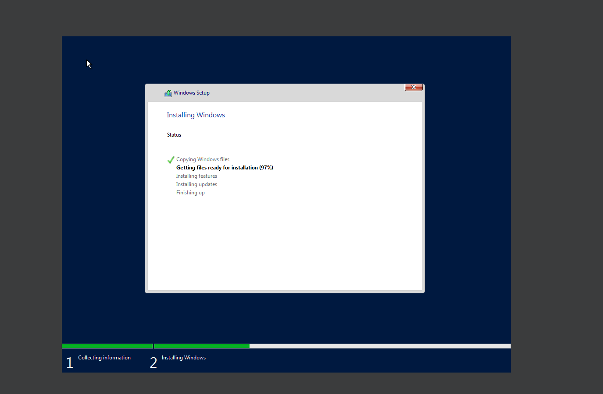

### 2) Set the local Administrator password
  
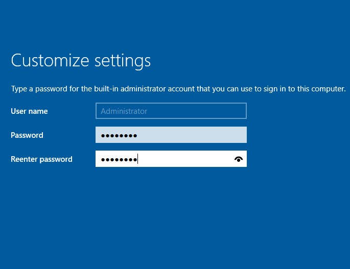

### 3) First login
Use **Ctrl+Alt+Delete** → sign in as **Administrator**.

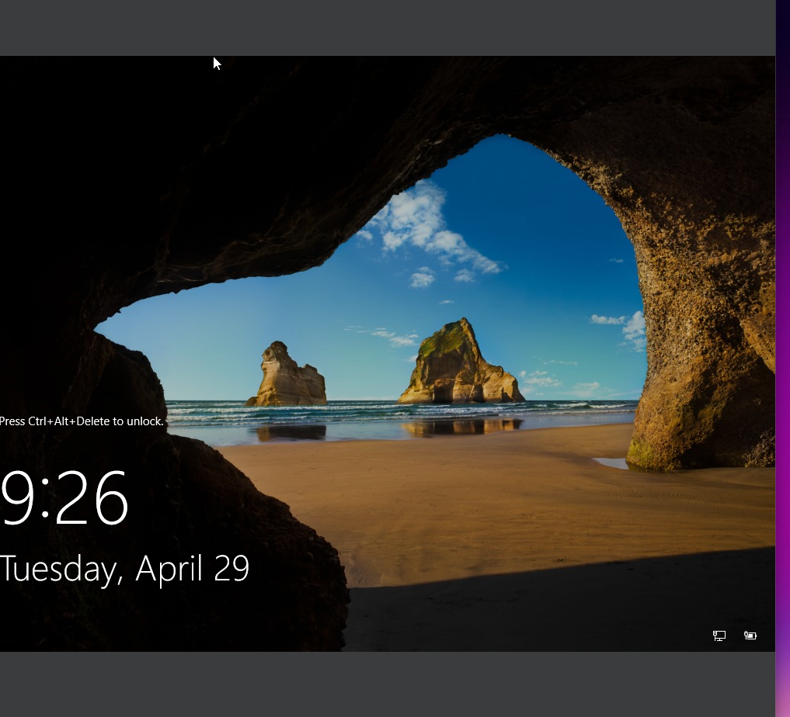

### 4) Open Server Manager
We’ll use **Server Manager** to configure roles and features.

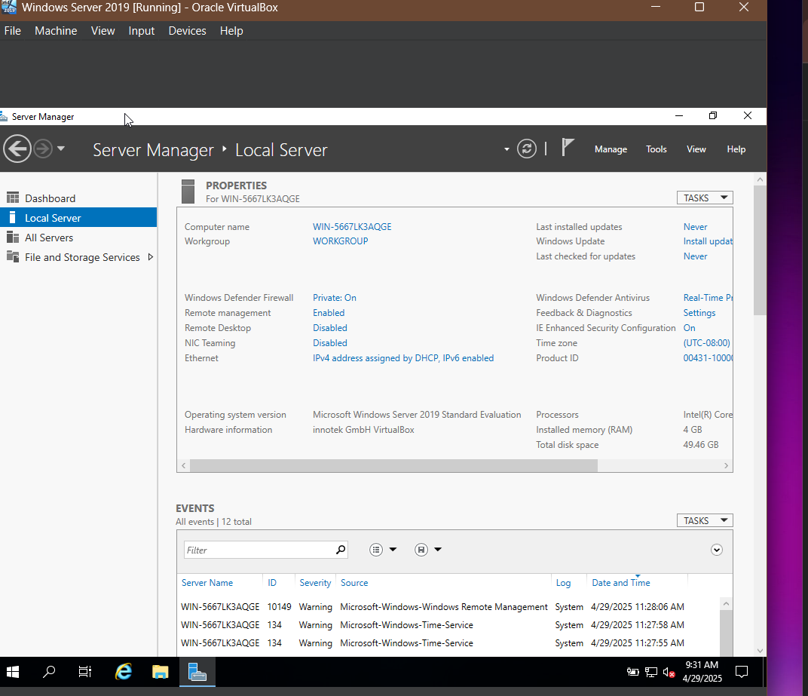

### 5) Configure static IPv4
Assign a static IP address and set DNS to point to itself (loopback or same IP).

### 6) Rename the server
Set a meaningful hostname before promoting to DC.

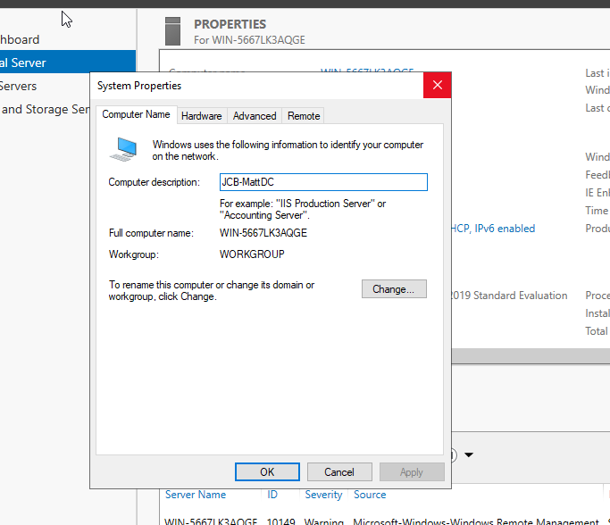

### 7) Add Roles: AD DS + DNS
Through **Add roles and features**, install both roles.

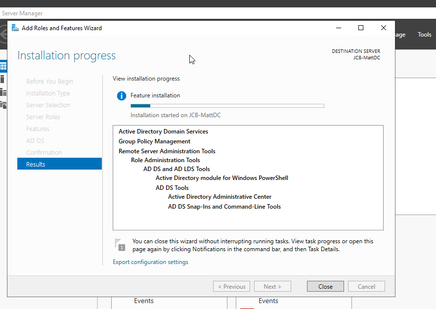

### 8) Roles installed successfully
AD DS role and management tools now available.

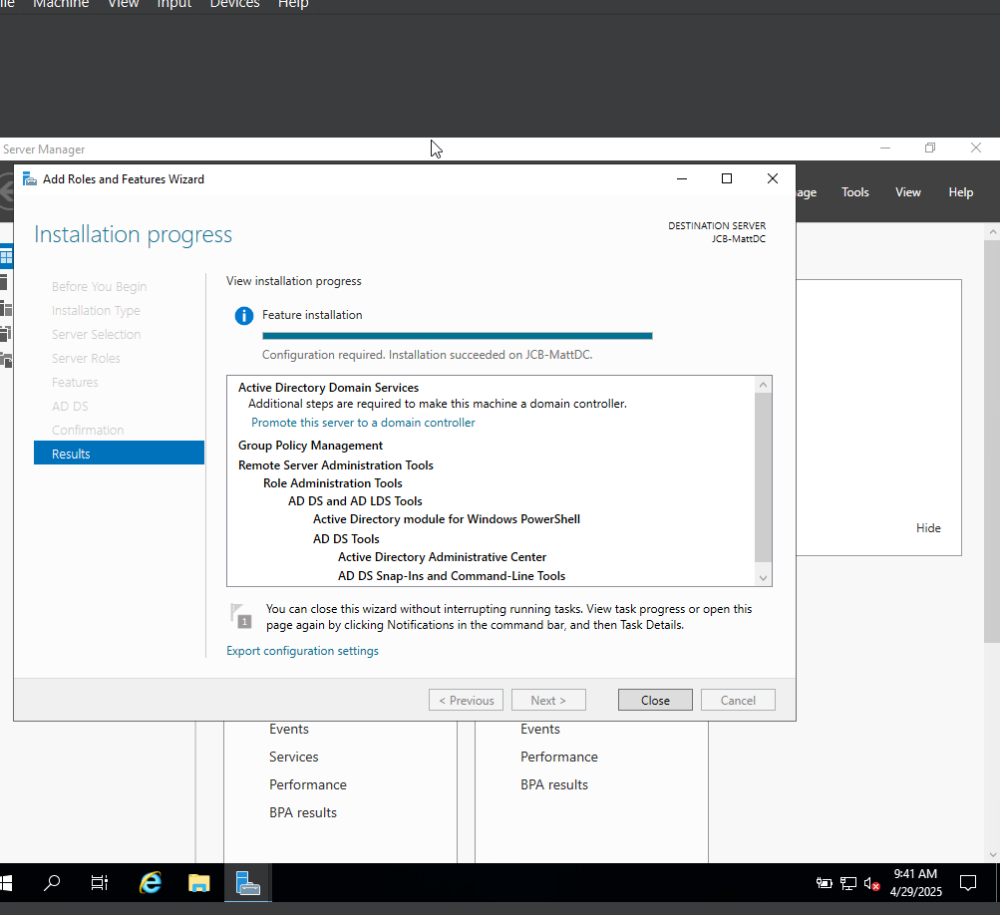

### 9) DNS configuration options
Review DNS delegation warning — expected in a standalone lab.

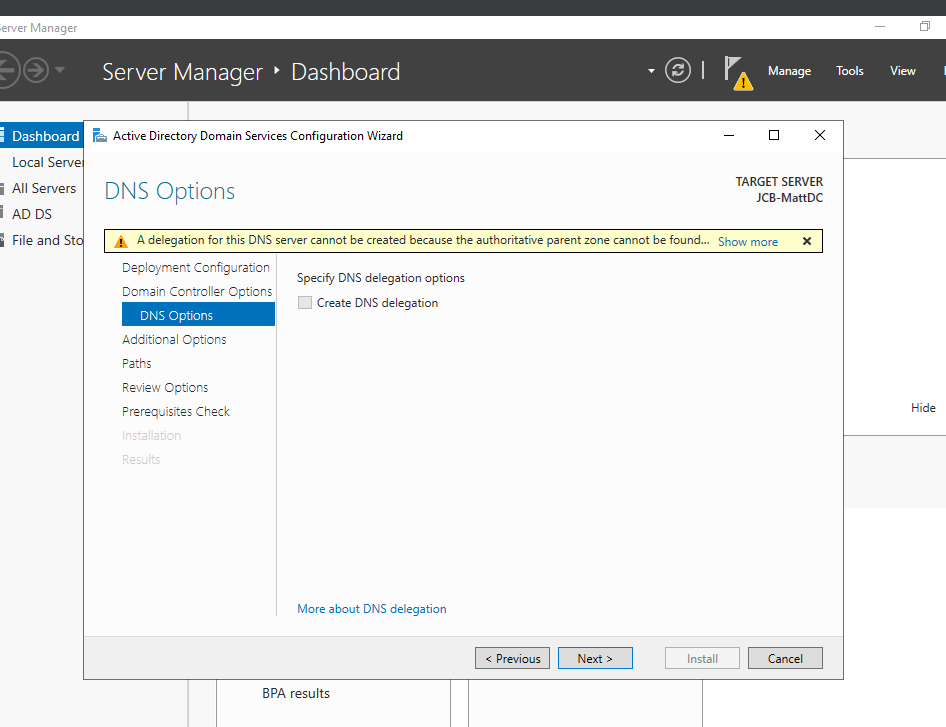

### 10) DNS warnings
Normal for single DC environments.

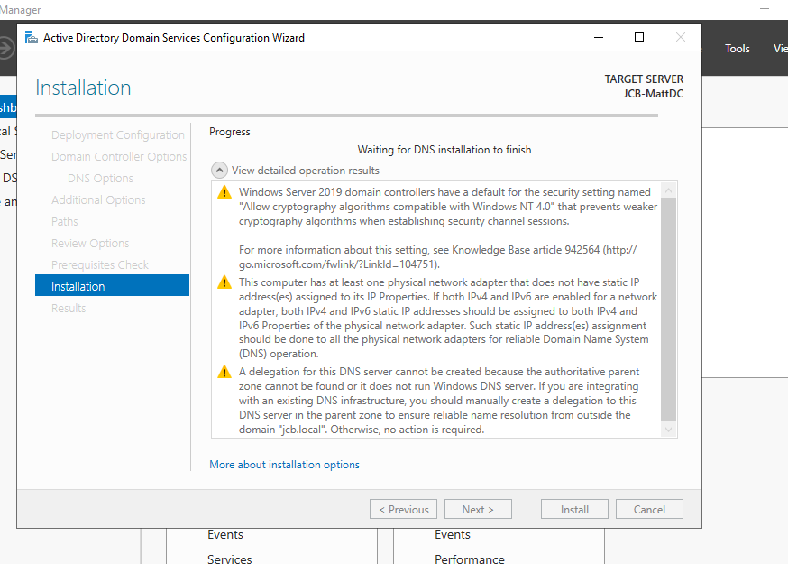

### 11) Create OUs & Users
After promotion and reboot, open **Active Directory Users and Computers** to create OUs and users.

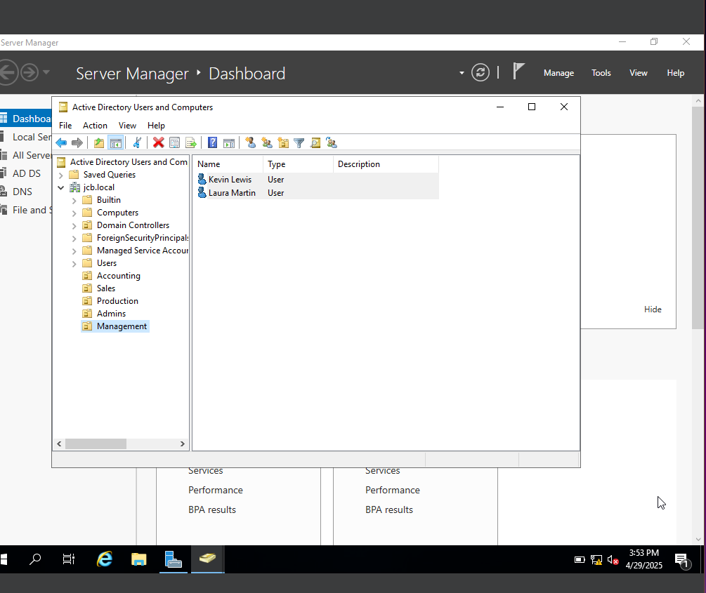

### 12) Verify Server Roles
Confirm **AD DS** and **DNS** are healthy in **Server Manager**.

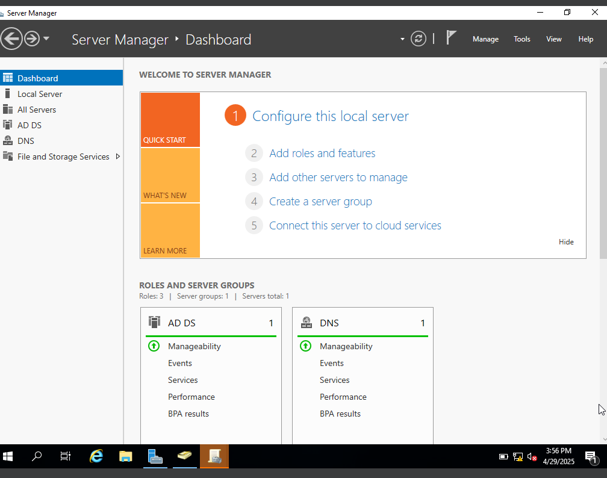

### 13) Create a Group Policy Object (GPO)
Open **Group Policy Management** and create a new GPO called “Password Policy”.

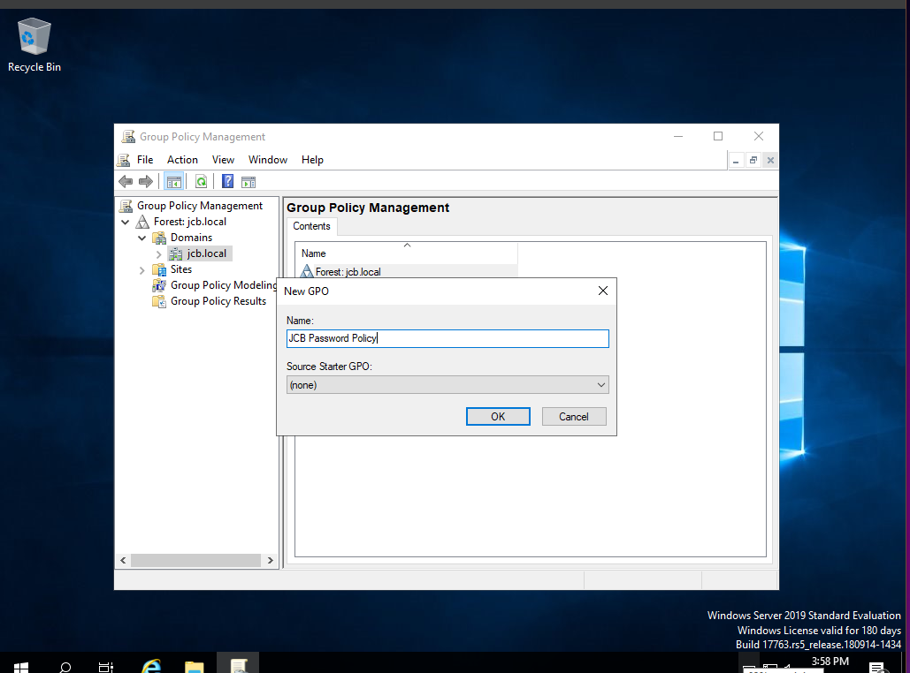

### 14) Configure password policy
Enable complexity, set minimum length, and enforce password history.

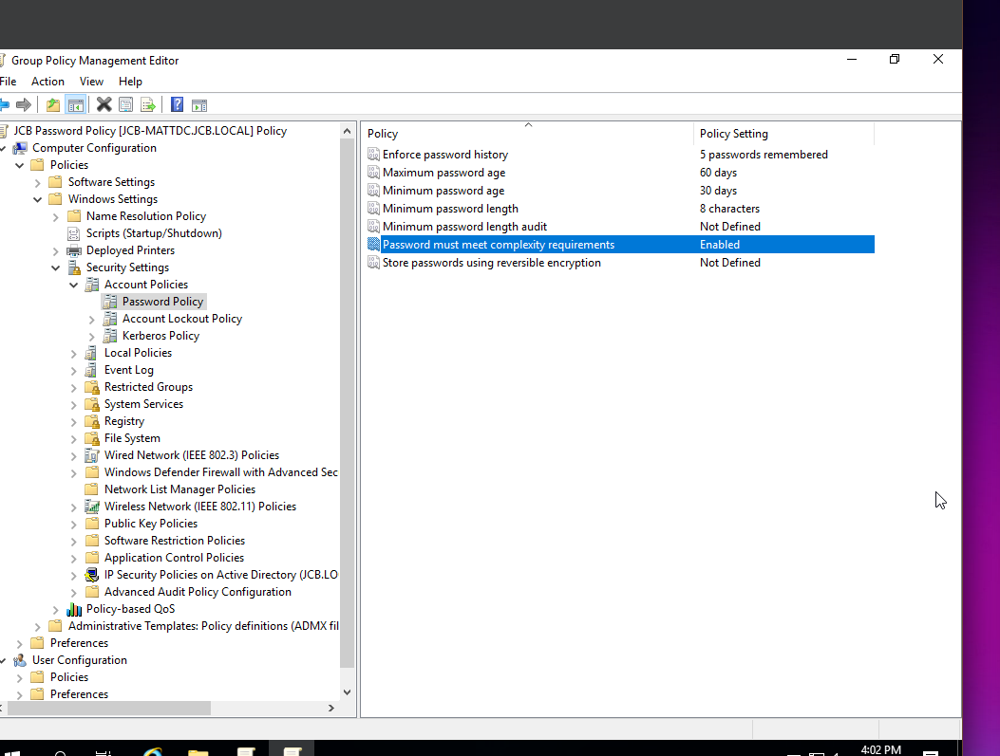

### 15) Final domain login
Log in using **DOMAIN\Administrator** or a created domain user.

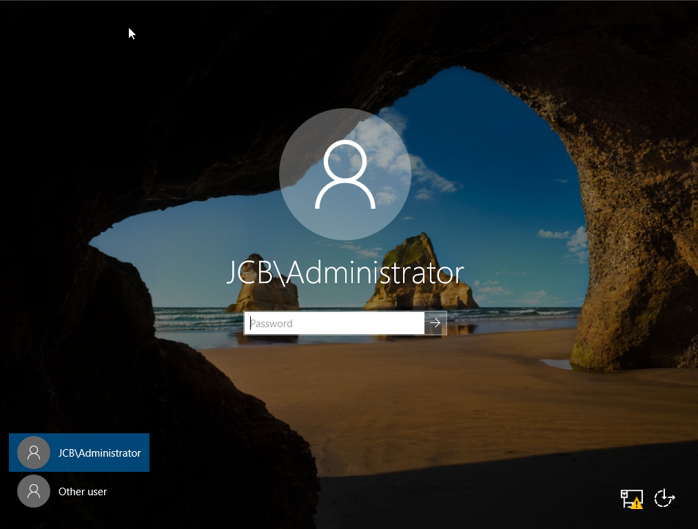

---

## ✅ What I Practiced

- Installing and configuring **Windows Server 2019**
- Deploying **Active Directory Domain Services** and **DNS**
- Promoting a standalone server to **Domain Controller**
- Structuring **Organizational Units** and managing users
- Applying **Group Policy** for password and security policies

---

## 🔗 Related Project

**[OPNsense Multi-Network Lab (Firewall & Routing)](https://github.com/Dmatthew227/opsense-multinet-lab)**  
Demonstrates multi-network routing, DHCP, and firewall policies using OPNsense.

---

## 📄 License
MIT — see [LICENSE](LICENSE)
